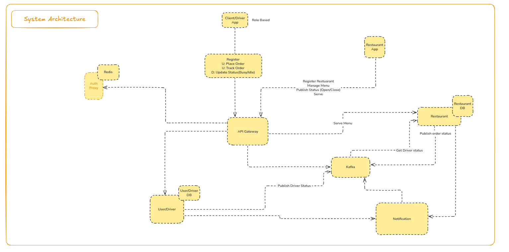

# Ha-Soranu 🍱

Ha-Soranu is a scalable, event-driven food delivery platform built with Go. Users can browse restaurants, place orders, receive notifications, and complete payments through a modern microservices architecture.

## Architecture

The system uses gRPC for service-to-service communication and an API Gateway to expose REST endpoints to clients. Kafka powers asynchronous event flows; Postgres backs service state; Redis/Valkey supports caching and tokens.



Figure: API Gateway, Auth, Restaurant, Notification, and Payment services with Postgres, Redis/Valkey, and Kafka.

### Core Services

| Service | Type | Description |
|---|---|---|
| [services/api-gateway](./services/api-gateway) | REST | Client entry point; HTTP ↔ gRPC mapping, routing, validation. |
| [services/auth-service](./services/auth-service) | gRPC | Identity, JWT/OAuth, token issuance and verification. |
| [services/restaurant-service](./services/restaurant-service) | gRPC | Restaurants, menus, and order lifecycle; emits order events. |
| [services/notification-service](./services/notification-service) | gRPC | Consumes order/payment events and sends user/restaurant notifications. |
| [services/payment-service](./services/payment-service) | HTTP | Payment intents, captures, refunds; integrates with providers; emits events. |

## Tech Stack

- Language: Go (go 1.25+)
- Communication: gRPC (internal), REST (external)
- Data: PostgreSQL (per service), Redis/Valkey
- Messaging: Apache Kafka (Protobuf payloads)
- Infra: Docker, Kubernetes, Tilt (local dev)
- Tooling: Make, protoc, Goose (migrations), Zap (logging)

## Project Structure

```bash
ha-soranu/
├── services/                 # Microservices code
│   ├── api-gateway/          # REST API Gateway (OpenAPI in docs/swagger.yaml)
│   ├── auth-service/         # Auth & user management (+ migrations)
│   ├── restaurant-service/   # Restaurants, menus, orders (+ migrations)
│   ├── notification-service/ # Notifications (+ migrations)
│   └── payment-service/      # Payments
├── protos/                   # Protobuf contracts (source .proto)
├── shared/                   # Shared libs: db, logger, events, config, utils, protos/*pb
├── infra/                    # Dockerfiles and Kubernetes manifests (dev/prod)
├── bin/                      # Built binaries (local dev)
├── tests/                    # Load tests and harness
├── Tiltfile                  # Tilt configuration
├── Makefile                  # Proto generation
└── go.mod                    # Go module
```

## Quick Start (Tilt)

Tilt orchestrates local builds and Kubernetes deploys.

### Prerequisites

- Go 1.25+
- Docker
- kubectl + a local Kubernetes cluster (e.g., Minikube)
- Tilt
- protoc and plugins: `protoc-gen-go`, `protoc-gen-go-grpc`

Install protoc plugins (if needed):

```bash
go install google.golang.org/protobuf/cmd/protoc-gen-go@latest
go install google.golang.org/grpc/cmd/protoc-gen-go-grpc@latest
```

### Run

```bash
# Start your local Kubernetes (example)
minikube start

# From repo root, launch the dev environment
tilt up
```

Tilt builds the services to ./bin, builds images with live-update, applies manifests under infra/dev/k8s, and port-forwards:

- API Gateway: http://localhost:8080
- Auth gRPC: localhost:50051
- Restaurant gRPC: localhost:50052
- Notification gRPC: localhost:50053

Note: Payment service manifests exist but aren’t wired into Tilt by default. See infra/dev/k8s/payment-service-deployment.yaml if you want to include it.

## Without Tilt (service-by-service)

You can run a service directly if dependencies are available (Postgres, Redis/Kafka where applicable) and env vars are set. Example (auth-service):

```bash
export SRV_ENV=development
export AUTH_SRV_NAME=auth-service
export AUTH_SRV_PORT=9090
export POSTGRES_HOST=localhost
export POSTGRES_PORT=5432
export POSTGRES_USER=postgres
export POSTGRES_PASSWORD=password
export POSTGRES_DB=authdb
go run ./services/auth-service/cmd
```

See each service’s `env.go` for defaults and required variables.

## Protobufs

After changing files in protos/, regenerate Go stubs:

```bash
make proto
```

This uses the root Makefile to invoke protoc with module-aware paths and writes generated code into the module per import paths (see shared/protos/*pb for existing packages).

## Database & Migrations

Each service owns its schema under services/<service>/migrations.

- Strategy: Pressly Goose. Some services embed/run migrations programmatically at startup.
- Manual usage example (auth-service):

```bash
# Using Goose CLI (adjust DSN and migration name)
cd services/auth-service
go install github.com/pressly/goose/v3/cmd/goose@latest
goose -dir migrations create add_new_table sql
```

## Testing & Load

Load tests live under tests/ and target the end-to-end order flow (API Gateway → Restaurant → Postgres → Kafka).

```bash
cd tests
make setup           # create venv and install deps
source venv/bin/activate
make seed            # seed test data
make run             # run with Locust UI
# or
./run_tests.sh all   # headless run
```

Reports are written to tests/reports/.

## API Documentation

- OpenAPI spec: services/api-gateway/docs/swagger.yaml (import into Swagger UI/Editor to explore)

## Configuration & Secrets

- Kubernetes dev manifests: infra/dev/k8s/*.yaml (config-map.yaml, secrets.yaml, per-service deployments)
- Environment variables: see each service’s env.go for defaults and required keys (JWT keys, DB, Redis/Valkey, ports)

## Troubleshooting

- protoc not found / stub generation fails: Install protoc and the Go plugins, then run make proto.
- Tilt doesn’t see changes: Ensure binaries under ./bin update (Tilt live-update syncs ./bin/* and ./shared/ into running containers).
- Ports already in use: Stop conflicting processes or adjust port_forwards in Tiltfile.
- Payment not reachable in dev: It’s not enabled in Tilt by default; deploy its manifest or add it to Tiltfile.

## Contributing

- Keep changes focused and incremental.
- Update protos and regenerate stubs when contracts change.
- Include or update migrations when persisting new state.
