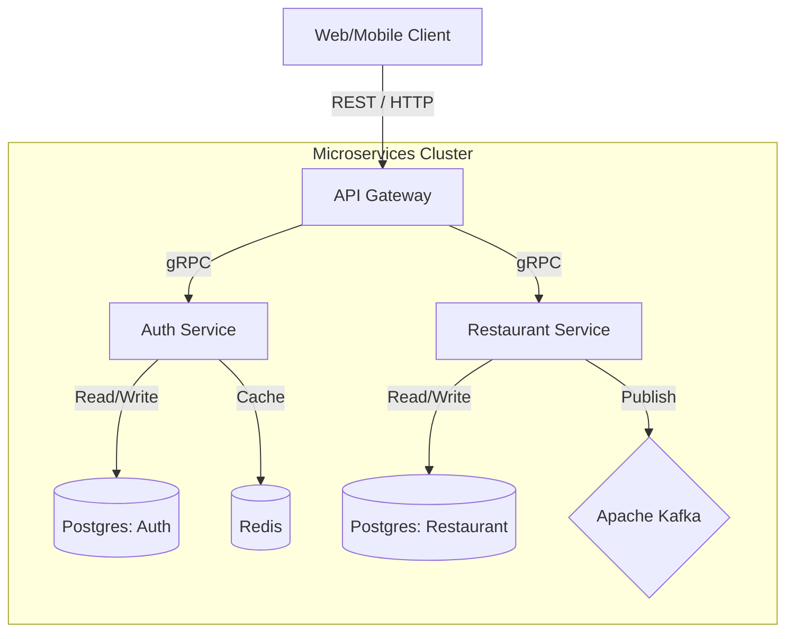

# Ha-Soranu 🍱

**Ha-Soranu** is a scalable, microservices-based online food delivery platform built with Go. It enables users to browse restaurants, view menus, and place orders through a modern, distributed architecture.

## 🏗️ Architecture

The system follows a microservices architecture using **gRPC** for inter-service communication and an **API Gateway** to expose RESTful endpoints to clients.



### Core Services

| Service | Type | Description |
|---------|------|-------------|
| **[api-gateway](./services/api-gateway)** | REST API | Entry point for all client requests. Handles routing, transformation (HTTP ↔ gRPC), and initial validation. |
| **[auth-service](./services/auth-service)** | gRPC | Manages user identity, authentication (JWT, OAuth), and profiles. |
| **[restaurant-service](./services/restaurant-service)** | gRPC | Manages restaurant profiles, menus, and order processing. Publishes order events to Kafka. |

---

## 🚀 Tech Stack

- **Language**: Go (Golang)
- **Communication**: gRPC (Inter-service), REST (Client-facing)
- **Frameworks**: 
  - [Gin](https://github.com/gin-gonic/gin) (HTTP Gateway)
  - [gRPC-Go](https://github.com/grpc/grpc-go) (RPC)
- **Databases**: PostgreSQL (Per-service databases)
- **Caching**: Redis (Token storage, session management)
- **Messaging**: Apache Kafka (Event-driven architecture)
- **Infrastructure**: 
  - Docker & Kubernetes (Containerization & Orchestration)
  - [Tilt](https://tilt.dev) (Local Development Environment)
- **Tooling**: Make, Goose (Migrations)

---

## 🛠️ Getting Started

The easiest way to run the entire platform locally is using **Tilt**.

### Prerequisites

- [Go 1.21+](https://go.dev/dl/)
- [Docker](https://www.docker.com/)
- [Kubernetes Cluster](https://kubernetes.io/) (Minikube)
- [Tilt](https://docs.tilt.dev/install.html)
- [Make](https://www.gnu.org/software/make/)

### Running Locally

1. **Start your Kubernetes cluster** (if not running):
   ```bash
   minikube start
   ```

2. **Run Tilt**:
   ```bash
   tilt up
   ```
   This will build all services, deploy them to Kubernetes, and set up port forwarding.

3. **Access the Application**:
   - **API Gateway**: `http://localhost:8080`
   - **Tilt UI**: `http://localhost:10350` (to monitor logs and status)

---

## 📁 Project Structure

```bash
ha-soranu/
├── services/               # Microservices source code
│   ├── api-gateway/        # REST API Gateway
│   ├── auth-service/       # Authentication & User Service
│   └── restaurant-service/ # Restaurant & Menu Service
├── protos/                 # Protocol Buffer definitions (gRPC contracts)
├── shared/                 # Shared libraries (DB packages, Logger, Middleware)
├── infra/                  # Infrastructure configurations (K8s, Docker)
├── bin/                    # Compiled binaries (ignored by git)
├── Tiltfile                # Tilt configuration for local dev
├── Makefile                # Global build and run commands
└── go.mod                  # Go module definition (Workspace mode)
```

---

## 🧩 Key Features

- **Authentication System**:
  - Secure Email/Password login.
  - **Google OAuth 2.0** integration.
  - JWT-based session management with Access & Refresh tokens.
  
- **Restaurant Management**:
  - Restaurant registration and profile management.
  - Menu CRUD operations (Items, prices, descriptions).
  - Geospatial discovery (Streaming API).
  
- **Order Processing**:
  - Order placement and status tracking.
  - Real-time order updates.
  - **Event-Driven**: Asynchronous order processing using Kafka.

---

## 🔧 Development

### Working with Protos

Protocol buffers are the contract between services. If you modify files in `protos/`, you must regenerate the Go code:

```bash
make proto
```

### Database Migrations

Each service manages its own database schema using **Goose**.

```bash
# Example: Create a new migration for auth-service
cd services/auth-service
goose -dir migrations postgres "user=postgres dbname=authdb sslmode=disable" create add_new_table sql
```

---

## 🤝 Contributing

1. Fork the repository.
2. Create a feature branch (`git checkout -b feature/amazing-feature`).
3. Commit your changes.
4. Push to the branch.
5. Open a Pull Request.

---

## 📜 License

This project is licensed under the MIT License.