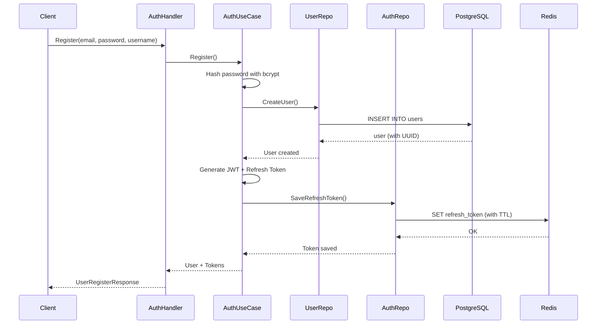
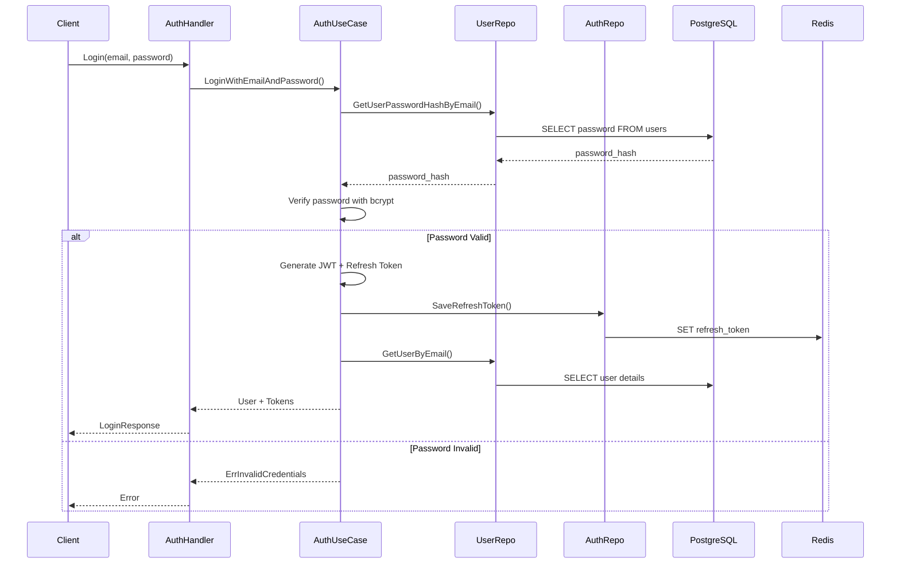
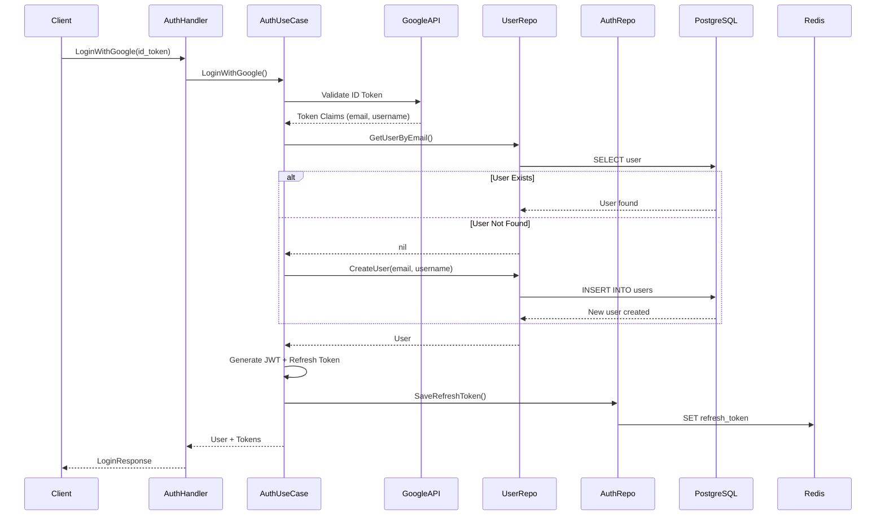
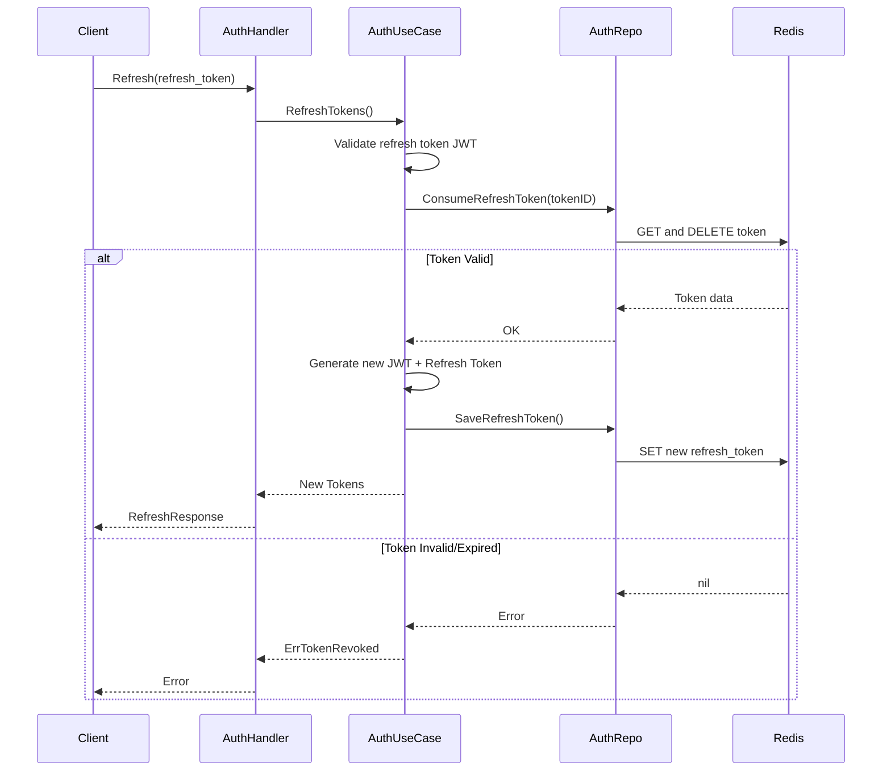

# Auth Service

## Overview

The Auth Service is a gRPC-based microservice that handles authentication and user management for the Ha-Soranu platform. It provides secure user registration, multiple authentication methods (email/password and Google OAuth), JWT-based session management, and comprehensive user profile capabilities including address and phone number management.

## Architecture

### Technology Stack

- **Framework**: gRPC (Protocol Buffers)
- **Database**: PostgreSQL (user data and profiles)
- **Cache/Session Store**: Redis (refresh tokens)
- **Language**: Go 1.x
- **Authentication**: JWT (Access & Refresh Tokens)
- **OAuth Provider**: Google OAuth 2.0
- **Password Hashing**: bcrypt
- **Migrations**: Goose
- **Logging**: Uber Zap (structured logging)

### Design Pattern

The service follows **Clean Architecture** principles with clear separation of concerns:

```
Presentation Layer (gRPC Handlers)
        ↓
Business Logic Layer (Use Cases)
        ↓
Data Access Layer (Repositories)
        ↓
Database/External Services (PostgreSQL, Redis)
```

### Project Structure

```
auth-service/
├── cmd/
│   └── main.go                   # Application entry point
├── internal/
│   ├── api/
│   │   └── grpc/
│   │       ├── dto/              # Protocol buffer transformers
│   │       │   ├── auth_dto.go
│   │       │   └── user_dto.go
│   │       ├── handler/          # gRPC request handlers
│   │       │   ├── auth_handler.go
│   │       │   └── user_handler.go
│   │       └── interceptor/
│   │           └── logging_interceptor.go  # gRPC logging
│   ├── domain/                   # Core business entities
│   │   ├── auth.go               # Authentication domain
│   │   ├── user.go               # User domain
│   │   ├── const/
│   │   │   └── constants.go
│   │   └── err/
│   │       └── au_errors.go      # Domain errors
│   ├── repository/               # Data access layer
│   │   ├── auth_repository.go    # Redis-based auth operations
│   │   └── user_repository.go    # PostgreSQL user operations
│   ├── usecase/                  # Business logic
│   │   ├── auth_usecase.go
│   │   └── user_usecase.go
│   └── util/                     # Helper utilities
│       ├── auth_token_utils.go   # JWT generation/validation
│       └── password_utils.go     # Password hashing
├── migrations/                   # Database migrations
│   ├── migrate.go
│   └── 20251212130432_updated_auth_schema1.sql
├── env.go                        # Environment configuration
└── README.md
```

## Core Features

### 1. Authentication

#### Multi-Method Authentication
- **Email/Password**: Traditional authentication with bcrypt password hashing
- **Google OAuth 2.0**: Single sign-on with Google accounts

#### Token-Based Sessions
- **Access Token**: Short-lived JWT (default: 15 minutes)
- **Refresh Token**: Long-lived token stored in Redis (default: 7 days)
- **Token Rotation**: Refresh tokens are consumed on use for security

#### Session Management
- Logout functionality invalidates refresh tokens
- Redis-based token storage with TTL
- Token refresh mechanism for seamless user experience

### 2. User Management

#### User Profile
- User ID (UUID)
- Email (unique)
- Username
- Phone number (optional)
- Creation timestamp

#### Address Management
- Multiple addresses per user
- Geocoding support (latitude/longitude)
- Full address details: street, city, state, postal code, country

### 3. Security Features

- **Password Security**: bcrypt hashing with cost factor
- **Email Uniqueness**: Database constraint prevents duplicate accounts
- **Token Expiration**: Configurable TTLs for access and refresh tokens
- **Token Revocation**: Logout invalidates refresh tokens
- **Google Token Validation**: Server-side verification of Google ID tokens

## gRPC Services

### AuthService

Defined in [`protos/auth.proto`](file:///home/tamirat-dejene/Documents/dis-sys/ha-soranu/protos/auth.proto)

| RPC Method | Request | Response | Description |
|------------|---------|----------|-------------|
| `Register` | `UserRegisterRequest` | `UserRegisterResponse` | Register new user with email/password |
| `LoginWithEmailAndPassword` | `EPLoginRequest` | `LoginResponse` | Authenticate with credentials |
| `LoginWithGoogle` | `GLoginRequest` | `LoginResponse` | Authenticate with Google ID token |
| `Logout` | `LogoutRequest` | `MessageResponse` | Invalidate refresh token |
| `Refresh` | `RefreshRequest` | `RefreshResponse` | Get new access token |

### UserService

Defined in [`protos/user.proto`](file:///home/tamirat-dejene/Documents/dis-sys/ha-soranu/protos/user.proto)

| RPC Method | Request | Response | Description |
|------------|---------|----------|-------------|
| `GetUser` | `GetUserRequest` | `GetUserResponse` | Retrieve user profile |
| `GetPhoneNumber` | `GetPhoneNumberRequest` | `GetPhoneNumberResponse` | Get user's phone number |
| `AddPhoneNumber` | `AddPhoneNumberRequest` | `MessageResponse` | Add phone number |
| `UpdatePhoneNumber` | `UpdatePhoneNumberRequest` | `MessageResponse` | Update phone number |
| `RemovePhoneNumber` | `RemovePhoneNumberRequest` | `MessageResponse` | Remove phone number |
| `GetAddresses` | `GetAddressesRequest` | `GetAddressesResponse` | Get all user addresses |
| `AddAddress` | `AddAddressRequest` | `AddAddressResponse` | Add new address |
| `RemoveAddress` | `RemoveAddressRequest` | `MessageResponse` | Remove address |

## Database Schema

### Users Table

```sql
CREATE TABLE users (
    user_id UUID PRIMARY KEY DEFAULT uuid_generate_v4(),
    email VARCHAR(100) NOT NULL UNIQUE,
    username VARCHAR(50) NOT NULL,
    phone_number VARCHAR(20),
    password VARCHAR(255) NOT NULL,
    created_at TIMESTAMP DEFAULT CURRENT_TIMESTAMP
);
```

**Key Constraints:**
- `email`: Unique constraint prevents duplicate registrations
- `user_id`: Auto-generated UUID primary key
- `password`: Stores bcrypt hash (never plaintext)

### Addresses Table

```sql
CREATE TABLE addresses (
    address_id UUID PRIMARY KEY DEFAULT uuid_generate_v4(),
    user_id UUID NOT NULL REFERENCES users(user_id) ON DELETE CASCADE,
    street VARCHAR(255),
    city VARCHAR(100),
    state VARCHAR(100),
    postal_code INTEGER,
    country VARCHAR(100),
    latitude REAL,
    longitude REAL,
    created_at TIMESTAMP DEFAULT CURRENT_TIMESTAMP
);
```

**Key Constraints:**
- Foreign key `user_id` with `ON DELETE CASCADE`
- Multiple addresses per user supported

### Migrations

Migrations are managed using **Goose** and run automatically on service startup.

Current migration: [`20251212130432_updated_auth_schema1.sql`](file:///home/tamirat-dejene/Documents/dis-sys/ha-soranu/services/auth-service/migrations/20251212130432_updated_auth_schema1.sql)

## Authentication Flow

### Registration Flow



### Login Flow (Email/Password)



### Google OAuth Flow



### Token Refresh Flow



## Configuration

### Environment Variables

Defined in [`env.go`](file:///home/tamirat-dejene/Documents/dis-sys/ha-soranu/services/auth-service/env.go):

| Variable | Description | Default Value |
|----------|-------------|---------------|
| **Service Settings** | | |
| `SRV_ENV` | Environment (development/production) | `development` |
| `AUTH_SRV_NAME` | Service name for discovery | `auth-service` |
| `AUTH_SRV_PORT` | gRPC server port | `9090` |
| **Google OAuth** | | |
| `GOOGLE_CLIENT_ID` | Google OAuth 2.0 Client ID | `""` (empty) |
| **JWT Settings** | | |
| `ACCESS_TOKEN_SECRET` | Secret for signing access tokens | `default_access_secret` |
| `REFRESH_TOKEN_SECRET` | Secret for signing refresh tokens | `default_refresh_secret` |
| `ACCESS_TOKEN_TTL` | Access token lifetime | `15m` |
| `REFRESH_TOKEN_TTL` | Refresh token lifetime | `7d` |
| **PostgreSQL** | | |
| `POSTGRES_HOST` | Database hostname | `postgres-db-` |
| `POSTGRES_PORT` | Database port | `5432` |
| `POSTGRES_USER` | Database user | `postgres` |
| `POSTGRES_PASSWORD` | Database password | `password` |
| `POSTGRES_DB` | Database name | `authdb` |
| **Redis** | | |
| `REDIS_HOST` | Redis hostname | `localhost` |
| `REDIS_PORT` | Redis port | `6379` |
| `REDIS_PASSWORD` | Redis password | `""` (empty) |
| `REDIS_DB` | Redis database number | `0` |

> [!WARNING]
> **Production Deployment**: Default secrets and passwords MUST be changed in production. Use strong, randomly generated secrets for JWT signing.

## Domain Layer

### Use Cases

#### AuthUseCase ([`internal/usecase/auth_usecase.go`](file:///home/tamirat-dejene/Documents/dis-sys/ha-soranu/services/auth-service/internal/usecase/auth_usecase.go))

**Responsibilities:**
- User registration with password hashing
- Email/password authentication
- Google OAuth authentication and user auto-creation
- JWT token generation and validation
- Refresh token management
- Logout (token invalidation)

**Dependencies:**
- `UserRepository`: Database operations
- `AuthRepository`: Token storage in Redis
- `Env`: Configuration (secrets, TTLs, Google Client ID)

#### UserUseCase ([`internal/usecase/user_usecase.go`](file:///home/tamirat-dejene/Documents/dis-sys/ha-soranu/services/auth-service/internal/usecase/user_usecase.go))

**Responsibilities:**
- User profile retrieval
- Phone number CRUD operations
- Address CRUD operations

**Dependencies:**
- `UserRepository`: Database operations

### Repositories

#### UserRepository ([`internal/repository/user_repository.go`](file:///home/tamirat-dejene/Documents/dis-sys/ha-soranu/services/auth-service/internal/repository/user_repository.go))

**PostgreSQL Operations:**
- `CreateUser()`: Insert new user with transaction support
- `GetUserByID()`: Fetch user by UUID
- `GetUserByEmail()`: Fetch user by email (for login)
- `GetUserPasswordHashByEmail()`: Fetch only password hash (for auth)
- `GetAddresses()`: Retrieve all addresses for a user
- `AddAddress()`: Insert new address
- `RemoveAddress()`: Delete address by ID
- `AddPhoneNumber()`, `UpdatePhoneNumber()`, `RemovePhoneNumber()`

**Features:**
- Transaction management for complex operations
- Error optimization via `OptimizedDbError()`
- Cascading deletes for user-address relationships

#### AuthRepository ([`internal/repository/auth_repository.go`](file:///home/tamirat-dejene/Documents/dis-sys/ha-soranu/services/auth-service/internal/repository/auth_repository.go))

**Redis Operations:**
- `SaveRefreshToken()`: Store refresh token with TTL
- `DeleteRefreshToken()`: Invalidate token on logout
- `ValidateRefreshToken()`: Check if token exists
- `ConsumeRefreshToken()`: Get and delete token (atomic operation)

**Features:**
- TTL-based expiration
- Token revocation support
- Atomic consume operation for security

## Utilities

### JWT Token Management ([`internal/util/auth_token_utils.go`](file:///home/tamirat-dejene/Documents/dis-sys/ha-soranu/services/auth-service/internal/util/auth_token_utils.go))

**Functions:**
- `SignUser()`: Generate access and refresh JWTs
- `ValidateAccessToken()`: Verify and parse access token
- `ValidateRefreshToken()`: Verify and parse refresh token
- `ValidateGoogleIDToken()`: Verify Google OAuth token with Google's API

**JWT Claims:**
Access Token:
- `user_email`: User's email address
- `exp`: Expiration timestamp
- `iat`: Issued at timestamp

Refresh Token:
- `user_email`: User's email address
- `token_id`: Unique refresh token identifier (UUID)
- `exp`: Expiration timestamp
- `iat`: Issued at timestamp

### Password Management ([`internal/util/password_utils.go`](file:///home/tamirat-dejene/Documents/dis-sys/ha-soranu/services/auth-service/internal/util/password_utils.go))

**Functions:**
- `HashPassword()`: Generate bcrypt hash from plaintext password
- `ComparePassword()`: Verify password against stored hash

**Security:**
- Uses bcrypt algorithm (industry standard)
- Automatic salt generation
- Configurable cost factor

## Error Handling

### Domain Errors ([`internal/domain/err/au_errors.go`](file:///home/tamirat-dejene/Documents/dis-sys/ha-soranu/services/auth-service/internal/domain/err/au_errors.go))

Common error types:
- `ErrInvalidCredentials`: Wrong email/password
- `ErrUserNotFound`: User doesn't exist
- `ErrUserAlreadyExists`: Duplicate email registration
- `ErrTokenRevoked`: Refresh token invalid/expired
- `ErrInternalServer`: Generic server error
- `OptimizedDbError()`: Translates database errors to domain errors

## gRPC Interceptors

### Logging Interceptor ([`internal/api/grpc/interceptor/logging_interceptor.go`](file:///home/tamirat-dejene/Documents/dis-sys/ha-soranu/services/auth-service/internal/api/grpc/interceptor/logging_interceptor.go))

Logs all gRPC requests with:
- Method name
- Duration
- Error status
- Structured logging via Zap

## Running the Service

### Prerequisites

1. **Go 1.x** installed
2. **PostgreSQL** instance running
3. **Redis** instance running
4. **Google OAuth Client ID** (for Google login)

### Local Development

```bash
# From project root
cd services/auth-service

# Set environment variables
export POSTGRES_HOST=localhost
export POSTGRES_PORT=5432
export POSTGRES_USER=postgres
export POSTGRES_PASSWORD=password
export POSTGRES_DB=authdb
export REDIS_HOST=localhost
export REDIS_PORT=6379
export ACCESS_TOKEN_SECRET=your-secret-key
export REFRESH_TOKEN_SECRET=your-refresh-secret
export GOOGLE_CLIENT_ID=your-google-client-id

# Run the service
go run cmd/main.go
```

### Database Setup

The service automatically runs migrations on startup. Migrations are located in `/app/migrations` (containerized) or the `migrations/` directory.

### Docker/Kubernetes

Deployed via Tilt for local development. See root `Tiltfile` for configuration.

## Testing

### Manual Testing with gRPC Client

Use tools like:
- **grpcurl**: Command-line gRPC client
- **BloomRPC**: GUI client for gRPC
- **Postman**: Supports gRPC requests

Example with grpcurl:

```bash
# Register user
grpcurl -plaintext -d '{"email":"user@example.com","password":"secret","username":"john"}' \
  localhost:9090 auth.AuthService/Register

# Login
grpcurl -plaintext -d '{"email":"user@example.com","password":"secret"}' \
  localhost:9090 auth.AuthService/LoginWithEmailAndPassword
```

### Integration Testing

The service can be tested through the API Gateway's REST endpoints, which proxy to this gRPC service.

## Logging

Structured logging with Uber Zap:

**Log Levels:**
- `INFO`: Service startup, successful operations
- `ERROR`: Failed operations, database errors
- `FATAL`: Critical errors that prevent startup

**Log Format:**
- Development: Console (human-readable)
- Production: JSON (machine-parseable)

**Key Logs:**
- Service initialization
- Database connection
- Redis connection
- Migration execution
- gRPC request logs (via interceptor)
- Authentication events
- Error traces

## Security Best Practices

> [!IMPORTANT]
> **Production Checklist:**

- [x] Passwords are hashed with bcrypt (never stored plaintext)
- [x] Email uniqueness enforced at database level
- [x] JWT tokens have configurable expiration
- [x] Refresh tokens are single-use (consumed on refresh)
- [ ] **TODO**: Implement access token blacklist for logout
- [ ] **TODO**: Add rate limiting for authentication endpoints
- [ ] **TODO**: Implement account lockout after failed login attempts
- [ ] **TODO**: Add email verification for new registrations
- [ ] **TODO**: Implement password strength requirements
- [ ] **TODO**: Add 2FA (Two-Factor Authentication) support

> [!CAUTION]
> **Critical Security Notes:**

1. **Change Default Secrets**: The default JWT secrets in `env.go` MUST be changed in production.

2. **HTTPS/TLS Required**: In production, use TLS for gRPC connections to encrypt data in transit.

3. **Google Client ID**: Google OAuth requires valid Client ID from Google Cloud Console.

4. **Database Credentials**: Never commit database passwords to version control. Use secrets management.

5. **Token Storage**: Refresh tokens are stored in Redis. Ensure Redis is properly secured and not publicly accessible.

## Performance Considerations

### Database Optimizations
- Indexed columns: `email` (UNIQUE index), `user_id` (PRIMARY KEY)
- Prepared statements used by pgx driver
- Connection pooling via PostgreSQL client

### Caching Strategy
- Refresh tokens cached in Redis (reduces database load)
- TTL-based expiration (automatic cleanup)

### Timeouts
- Context timeouts on all repository operations (default: 5 seconds)
- Prevents hanging requests and resource leaks

## Monitoring & Observability

> [!NOTE]
> **Future Enhancements:**

- [ ] Metrics export (Prometheus)
- [ ] Distributed tracing (OpenTelemetry)
- [ ] Health check endpoint
- [ ] Readiness probe (DB + Redis connectivity)
- [ ] Liveness probe
- [ ] Performance metrics (auth success rate, latencies)

## Troubleshooting

### Common Issues

**Problem**: Migration fails on startup  
**Solution**: Ensure PostgreSQL is accessible and credentials are correct. Check migration files for syntax errors.

**Problem**: Google OAuth login fails  
**Solution**: Verify `GOOGLE_CLIENT_ID` is set correctly and matches Google Cloud Console configuration.

**Problem**: Tokens expire immediately  
**Solution**: Check `ACCESS_TOKEN_TTL` and `REFRESH_TOKEN_TTL` formats (e.g., "15m", "7d").

**Problem**: Cannot connect to Redis  
**Solution**: Verify Redis is running and `REDIS_HOST:REDIS_PORT` is correct.

**Problem**: Duplicate user registration despite unique email constraint  
**Solution**: This is expected behavior. Database will reject duplicates. Ensure error is handled gracefully in use case.

**Problem**: Password validation always fails  
**Solution**: Ensure password is hashed during registration. Check bcrypt implementation.

## Dependencies

### External Libraries

```go
require (
    github.com/jackc/pgx/v5              // PostgreSQL driver
    github.com/google/uuid               // UUID generation
    google.golang.org/grpc               // gRPC framework
    google.golang.org/protobuf           // Protocol buffers
    github.com/golang-jwt/jwt/v5         // JWT token handling
    golang.org/x/crypto/bcrypt           // Password hashing
    google.golang.org/api/idtoken        // Google OAuth validation
    github.com/pressly/goose/v3          // Database migrations
    go.uber.org/zap                      // Logging
)
```

### Internal Dependencies

- `shared/db/pg`: PostgreSQL client wrapper
- `shared/redis`: Redis client wrapper
- `shared/pkg/logger`: Centralized logger
- `shared/protos/authpb`: Generated gRPC code for AuthService
- `shared/protos/userpb`: Generated gRPC code for UserService

## Related Services

- **api-gateway**: HTTP/REST gateway that consumes this gRPC service
- **user-service**: (Future) May delegate user operations to separate service

## Future Enhancements

- [ ] Email verification on registration
- [ ] Password reset flow
- [ ] Account deletion
- [ ] OAuth support for additional providers (Facebook, GitHub)
- [ ] Multi-factor authentication (MFA/2FA)
- [ ] Session management (track active sessions, device information)
- [ ] Rate limiting and brute-force protection
- [ ] User roles and permissions
- [ ] Audit logging for security events
- [ ] Soft delete for users (instead of hard delete)

## Contributing

When adding new features:
1. Define domain models in `internal/domain/`
2. Implement repository methods in `internal/repository/`
3. Implement use case logic in `internal/usecase/`
4. Create gRPC handlers in `internal/api/grpc/handler/`
5. Update proto definitions if needed
6. Add database migrations for schema changes
7. Update this README

## License

Part of the Ha-Soranu microservices platform.
