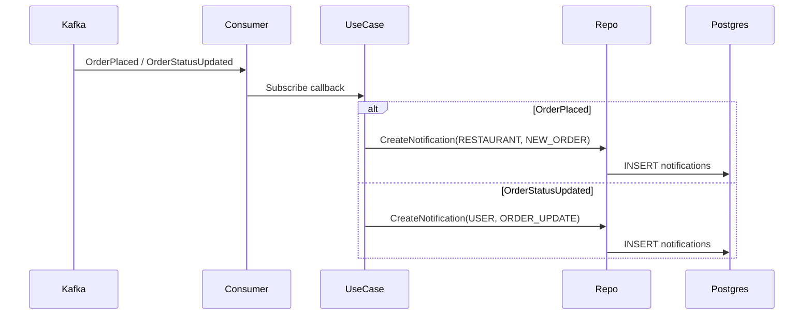

# Notification Service

## Overview

The Notification Service is a gRPC-based microservice responsible for generating and serving notifications for users and restaurants within the Ha-Soranu platform. It consumes domain events from Kafka (e.g., OrderPlaced, OrderStatusUpdated), persists notifications in PostgreSQL, and exposes gRPC endpoints to fetch, mark-as-read, and delete notifications.

## Architecture

### Technology Stack

- gRPC (Protocol Buffers)
- PostgreSQL (notifications storage)
- Kafka (event consumption via Sarama client)
- Go 1.x
- Migrations: Goose (embedded SQL)
- Logging: Uber Zap

### Design Pattern

Follows Clean Architecture with clear separation of concerns:

```
Presentation Layer (gRPC Handlers)
        ↓
Business Logic Layer (Use Cases)
        ↓
Data Access Layer (Repositories)
        ↓
Infrastructure (PostgreSQL, Kafka)
```

### Project Structure

```
notification-service/
├── cmd/
│   └── main.go                       # Service entrypoint
├── internal/
│   ├── api/
│   │   └── grpc/handler/             # gRPC handlers
│   │       └── notification_handler.go
│   ├── domain/                       # Core entities & interfaces
│   │   ├── notification.go
│   │   └── errors.go
│   ├── repository/                   # PostgreSQL repository
│   │   └── notification_repository.go
│   └── usecase/                      # Business logic + Kafka consumers
│       └── notification_usecase.go
├── migrations/                       # Goose migrations (embedded)
│   ├── 20251229000000_init_notifications.sql
│   └── migrations.go
├── env.go                            # Environment configuration
└── README.md
```

## Core Features

- Event-driven notifications from Kafka:
  - `OrderPlaced` → creates a restaurant notification ("New Order Received").
  - `OrderStatusUpdated` → creates a user notification ("Order Status Updated").
- gRPC API for clients:
  - Fetch notifications for a recipient.
  - Mark notification as read.
  - Delete notification.
- Efficient queries with composite index on `(recipient_id, recipient_type)`.

## gRPC Services

Defined in protos/notification.proto.

| RPC Method | Request | Response | Description |
|------------|---------|----------|-------------|
| `GetNotifications` | `GetNotificationsRequest` | `GetNotificationsResponse` | Fetch notifications for a recipient (`USER` or `RESTAURANT`). |
| `MarkAsRead` | `MarkAsReadRequest` | `MarkAsReadResponse` | Mark a notification as read. |
| `DeleteNotification` | `DeleteNotificationRequest` | `DeleteNotificationResponse` | Delete a notification. |

### Proto: Key Messages

- `Notification { id, recipient_id, recipient_type, order_id, title, message, is_read, type, created_at }`
- `GetNotificationsRequest { recipient_id, recipient_type }`
- `GetNotificationsResponse { repeated notifications }`
- `MarkAsReadRequest { notification_id }` → `MarkAsReadResponse { success }`
- `DeleteNotificationRequest { notification_id }` → `DeleteNotificationResponse { success }`

## Event Flow



## Database Schema

Managed via Goose migrations (embedded at runtime). Initial schema:

```sql
CREATE TABLE IF NOT EXISTS notifications (
    id UUID PRIMARY KEY DEFAULT uuid_generate_v4(),
    recipient_id UUID NOT NULL,
    recipient_type VARCHAR(50) NOT NULL, -- 'USER' or 'RESTAURANT'
    order_id UUID NOT NULL,
    title VARCHAR(255) NOT NULL,
    message TEXT NOT NULL,
    is_read BOOLEAN DEFAULT FALSE,
    type VARCHAR(50) NOT NULL,
    created_at TIMESTAMP DEFAULT CURRENT_TIMESTAMP
);

CREATE INDEX idx_notifications_recipient ON notifications(recipient_id, recipient_type);
```

> Note: Ensure the `uuid-ossp` extension is enabled in your PostgreSQL database if not already (for `uuid_generate_v4()`).

## Configuration

Environment variables (loaded in `env.go`):

| Variable | Description | Default |
|----------|-------------|---------|
| `SRV_ENV` | Environment (development/production) | `development` |
| `NOTIFICATION_SRV_PORT` | gRPC server port | `50053` |
| `NOTIFICATION_SRV_CONSUMER_GROUP` | Kafka consumer group | `notification-service-group` |
| `POSTGRES_HOST` | Postgres host | `postgres-db` |
| `POSTGRES_PORT` | Postgres port | `5432` |
| `POSTGRES_USER` | Postgres user | `postgres` |
| `POSTGRES_PASSWORD` | Postgres password | `password` |
| `POSTGRES_DB` | Database name | `notification_db` |
| `KAFKA_BROKER_URL` | Kafka bootstrap address | `localhost:9092` |

Kubernetes config for dev cluster is provided in `infra/dev/k8s/config-map.yaml` and secrets in `infra/dev/k8s/secrets.yaml`.

## Running Locally

### Prerequisites

- Go 1.x
- PostgreSQL reachable with the configured credentials
- Kafka broker reachable at `KAFKA_BROKER_URL`
- Generated protobufs (see "Development" below)

### Build & Run

```bash
# Generate protobufs (if you changed .proto files)
make proto

# Build the service binary
go build -o bin/notification-service services/notification-service/cmd/main.go

# Export local env vars (example)
export SRV_ENV=development
export NOTIFICATION_SRV_PORT=50053
export POSTGRES_HOST=localhost
export POSTGRES_PORT=5432
export POSTGRES_USER=postgres
export POSTGRES_PASSWORD=password
export POSTGRES_DB=notification_db
export KAFKA_BROKER_URL=localhost:9092
export NOTIFICATION_SRV_CONSUMER_GROUP=notification-service-group

# Run the binary
./bin/notification-service
```

On startup, the service:

1. Loads environment.
2. Initializes Zap logger.
3. Applies Goose migrations (embedded SQL).
4. Connects to PostgreSQL.
5. Starts Kafka consumer (background goroutine).
6. Serves gRPC on `:${NOTIFICATION_SRV_PORT}`.

## Docker

The dev Dockerfile is at `infra/dev/docker/notification-service.Dockerfile` and expects the compiled binary at `bin/notification-service` and embeds migrations.

```bash
# Build binary first
go build -o bin/notification-service services/notification-service/cmd/main.go

# Build image
docker build -f infra/dev/docker/notification-service.Dockerfile -t ha-soranu/notification-service .

# Run container (example)
docker run --rm -p 50053:50053 \
  -e SRV_ENV=development \
  -e POSTGRES_HOST=host.docker.internal \
  -e POSTGRES_PORT=5432 \
  -e POSTGRES_USER=postgres \
  -e POSTGRES_PASSWORD=password \
  -e POSTGRES_DB=notification_db \
  -e KAFKA_BROKER_URL=host.docker.internal:9092 \
  -e NOTIFICATION_SRV_CONSUMER_GROUP=notification-service-group \
  ha-soranu/notification-service
```

## Kubernetes (Dev)

Manifests in `infra/dev/k8s/notification-service-deployment.yaml` and `infra/dev/k8s/config-map.yaml`.

```bash
# Create namespace (if not exists)
kubectl apply -f infra/dev/k8s/ha-soranu-namespace.yaml

# Apply shared config + secrets
kubectl apply -f infra/dev/k8s/config-map.yaml
kubectl apply -f infra/dev/k8s/secrets.yaml

# Deploy notification-service
kubectl apply -f infra/dev/k8s/notification-service-deployment.yaml

# Check status
kubectl -n ha-soranu get pods,svc
```

The service is exposed as a ClusterIP on port `50053`.

## Development

### Protobufs

Proto sources are under `protos/`. Generate code with:

```bash
make proto
```

### Logging

Uses Uber Zap with structured logs. Log level/config depends on `SRV_ENV`.

## Troubleshooting

- PostgreSQL migrations fail: verify connectivity and that `uuid-ossp` is enabled.
- Kafka consumer not receiving events: confirm topics and broker address; ensure producers are emitting `EventEnvelope` with correct `EventType`.
- Empty notifications: verify recipient IDs and types passed to `GetNotifications`.

## References

- Proto: `protos/notification.proto`
- Kafka Events: `shared/pkg/events`
- Event Envelope: `shared/protos/envent_envelopepb`
- Order Events: `shared/protos/orderpb`
